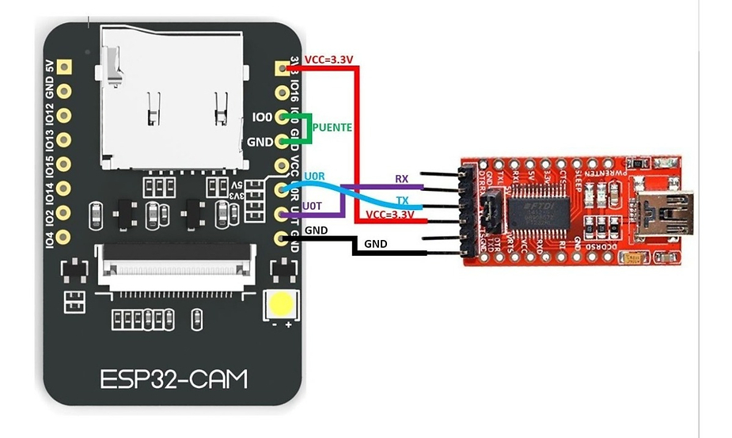
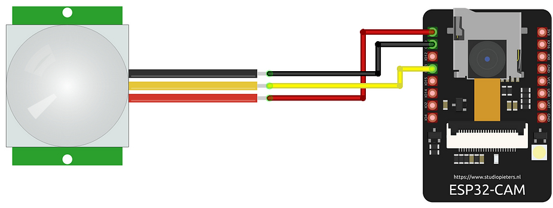
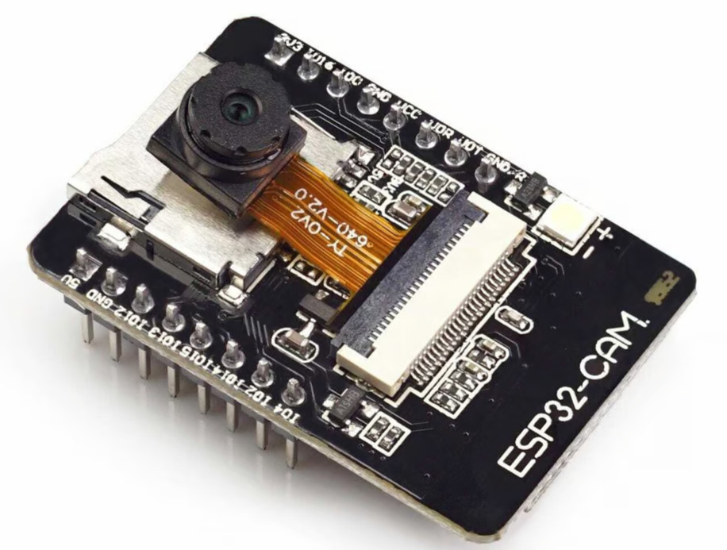
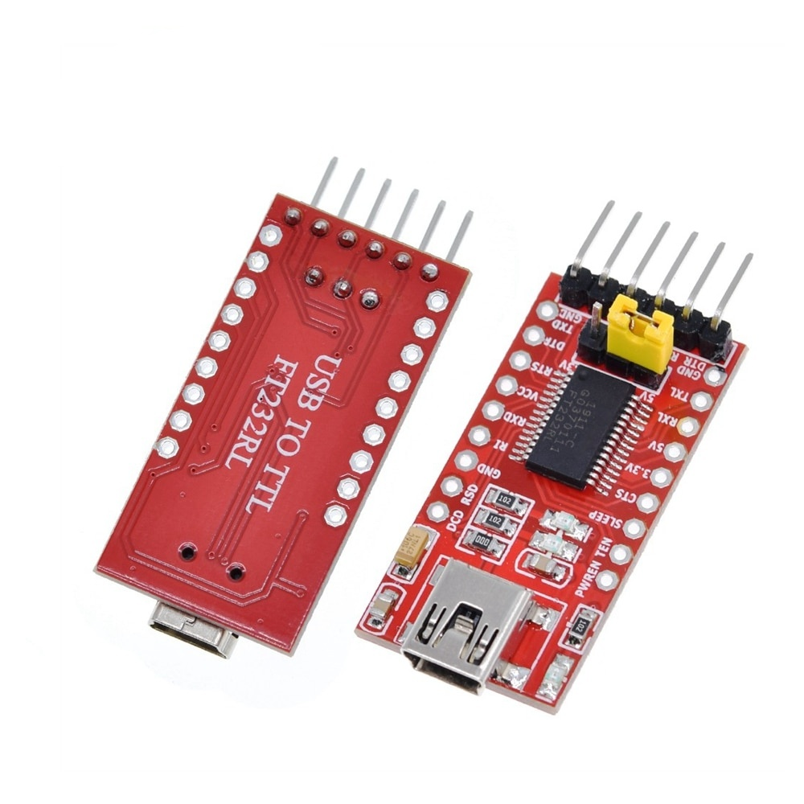
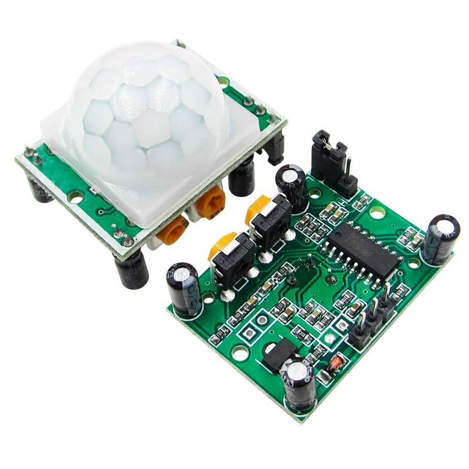
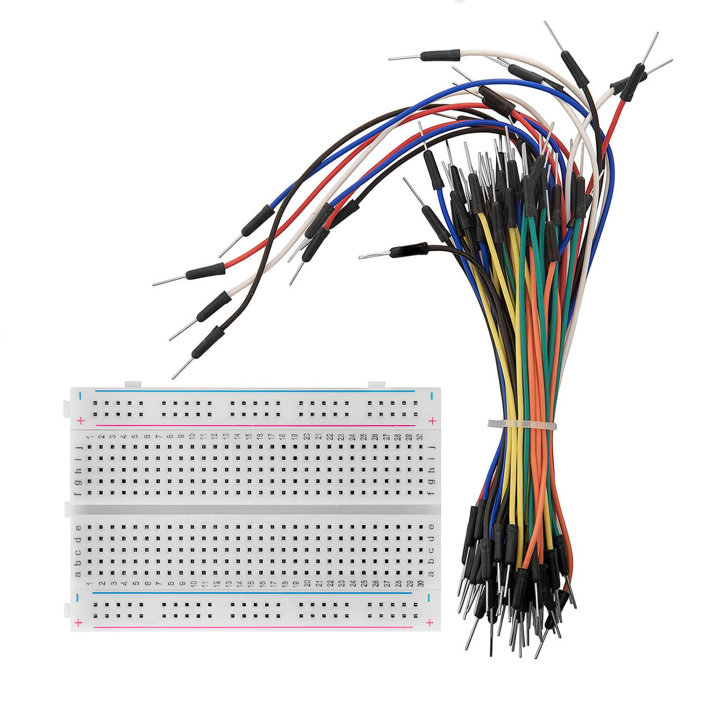

# Smart Motion-Capture Surveillance System

## System Design and Implementation

### System Diagram

_Figure: TTL to ESP32 CAM Connection_

_Figure: ESP32 CAM Board to PIR Motion Sensor Connection_

## Description of Components

### ESP32 Camera Module

This module has built-in Wi-Fi support. It can capture images and send them to the user’s Telegram account through Telegram Bot.

    
     
    <i>Figure: ESP32 Camera Module</i>

### FTDI USB to TTL Serial Converter

Used for programming the ESP32 Camera Module.

    
     
    <i>Figure: FTDI USB to TTL Serial Converter Adapter (FT232RL)</i>

### PIR Motion Sensor

Detects motion within its range and triggers the camera.

    
     
    <i>Figure: HC-SR501 PIR Motion Sensor Module</i>

### Breadboard and Jumper Wires

Facilitate connections between components.

    
     
    <i>Figure: Breadboard and Jumper Wires</i>

## How to Build the System

1. **Setting up Arduino IDE**: By default, ESP32 Board is not added in the Arduino IDE. So we need to add the following two links in the preferences section as Additional Boards Manager URLs. 
   
   Link:
   
   [https://raw.githubusercontent.com/espressif/arduino-esp32/gh-pages/package_esp32_index.json](https://raw.githubusercontent.com/espressif/arduino-esp32/gh-pages/package_esp32_index.json)
   
   [https://dl.espressif.com/dl/package_esp32_index.json](https://dl.espressif.com/dl/package_esp32_index.json)
   
   After that install esp32 by espressif systems from the board manager.

2. **Installing required Libraries**: Go to the Library Manager of Arduino IDE and install the following libraries:
   - ArduinoJson
   - UniversalTelegramBot

3. **Configure Wi-Fi Connection**: Configure Wi-Fi network to connect with the ESP32 module. Save the SSID and Password of your Wi-Fi. These will be used in the code to connect the module.

4. **Setting Up Telegram Bot**: Follow the steps to create a new bot and use it.
   - Search for **BotFather** in the Telegram App. Open the chat.
   - Now type `/newbot` command to create a new bot.
   - Give a unique name for your bot. Then create a username for your bot, the username must end with the ‘bot’.
   - After that, you will get the bot token. The token starts with a number following a colon and some random text. Save it for later use.
   - Now, we need to extract our chat ID. There are many bots for that such as: **IDBot**. Press `/start` and then `/getid` to get your own unique chat ID. Save it for later use.
   - Now copy both the chat ID and bot token and paste them in the code.

5. **Connect TTL converter with the ESP module**: Connect FTDI USB to TTL Serial Converter to the ESP32 CAM module as shown in the system design.

6. **Program the ESP32 Camera Module**: Connect TTL converter with the computer using USB B type cable. Open Arduino IDE and write the code. After that upload the code to the ESP32 Module. 
    
    Before uploading the code, go to tools and set all the settings like the following:
   - Board: ESP32 Wrover Module
   - Upload Speed: 921600
   - Flash Frequency: 80MHz
   - Flash Mode: QIO
   - Partition Scheme: Huge APP (3MB No OTA/1MB SPIFFS)
   - Core Debug Level: None
   - Port: COM11
   - Programmer: ArduinoISP
   
   When the upload is finished remove the connection of IO0 and GND of the ESP32 module.

7. **Assemble Hardware Components**: Connect the ESP32 Camera Module with PIR Motion Sensor on the breadboard using jumper wires.

8. **Add Power Supply**: You can use 5V power supply directly to the GND and 5V pin of the ESP32 CAM Board or can connect the ttl converter and use USB B type cable for power supply from laptop or desktop.

9. **Test the System**: Verify the motion detection and image capture functionality. Ensure that images are sent to the Telegram account in real-time.

10. **Deploy the System**: To deploy the system, there must be a good connection to the Wi-Fi and continuous power supply.
